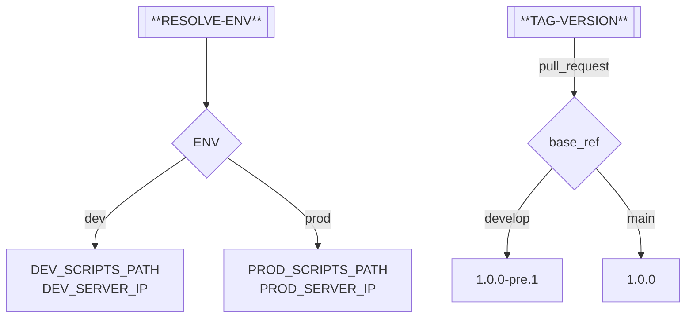
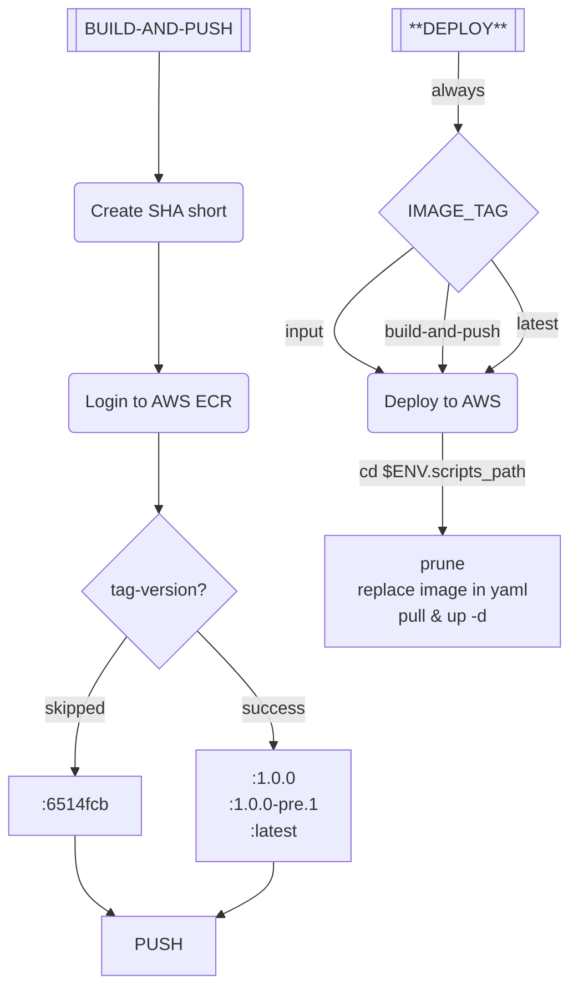

# Versioned Repo
Demo purposes 

## Settings

We use options described in [github-tag-action] repo: 
- `DEFAULT_BUMP` (optional) - `patch` - Which type of bump to use when none explicitly provided (default: `minor`).


## Workflow logic





## Troubleshooting

```
pre_release = false
fatal: ambiguous argument 'develop..HEAD': unknown revision or path not in the working tree.
Use '--' to separate paths from revisions, like this:
'git <command> [<revision>...] -- [<file>...]'
```
line 163:
```sh
declare -A history_type=(
    ["last"]="$(git show -s --format=%B)" \
    ["full"]="$(git log "${default_branch}"..HEAD --format=%B)" \
    ["compare"]="$(git log "${tag_commit}".."${commit}" --format=%B)" \
)
```

---
[github-tag-action]: https://github.com/anothrNick/github-tag-action/blob/master/README.md#options
